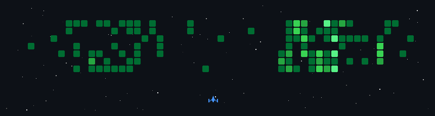

# Bari 

**`Fullstack Developer`**

I'm a full-stack software developer. I plan, code, deploy and monitor my projects. 
Writing is easy, creating and deploying is hard, monitoring and fixing is what really counts. 

---

### Languages and Tools

 

#

### 

#
